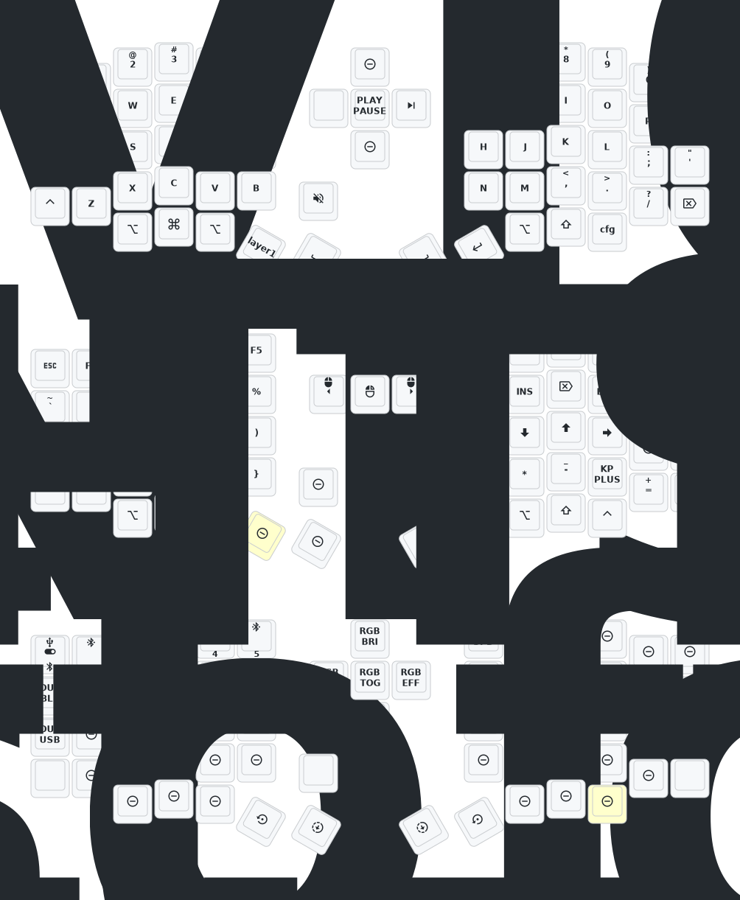

# Keyboard

[Sofle Split (Standard version)](https://de.aliexpress.com/item/1005008176724988.html?spm=a2g0o.order_list.order_list_main.16.186b5c5fNgYmZ1&gatewayAdapt=glo2deu)

## Boards

### Right
- Model: [nice!nano](https://nicekeyboards.com/docs/nice-nano/)
- Board-ID: nRF52840-nicenano
- SoftDevice: S140 version 6.1.1

# Sofle Keymap

Use the [keymap-editor](https://nickcoutsos.github.io/keymap-editor/) to change the key map.

ℹ️ Update the image with the [GitHub action](https://github.com/ElQDuck/zmk-sofle/actions/workflows/draw.yml)

# How To Flash Keyboard

1. Build Firmware with [Action: Build ZMK firmware](https://github.com/ElQDuck/zmk-sofle/actions/workflows/build.yml) and download the result files (`firmware.zip`).
  - The zip folder contains up to 3 files:
    - zmk-right
    - zmk-left
    - zmk-left-settings-reset (can be ignored)
2. Turn on the keyboard you want to flash and plug it to the PC.
3. Press 2 times (fast) the reset button (beside the on/off switch) on the keyboard.
  - A USB drive should appear
4. Copy `zmk-right` or `zmk-left` into the USB drive.
  - When the file copy is finished, the Keyboard installs the firmware and restarts automatically.

# Changelog

- 2025/3/30
  1. Increase sleep entry time by 1 hour.
  2. Increase stabilization time Optimize power consumption after sleep.
- 2024/12/21
  1. Added support for zmk-studio (just refresh the left hand to use).
- 2024/10/24
  1. Modified power supply mode to reduce power consumption.
  2. Fixed the automatic shut-off feature for RGB power supply.

# Contact

For 3D printed model files or any issues and malfunctions with the keyboard, please contact 380465425@qq.com

# Additional links
- [EurKEY The European Keyboard Layout](https://eurkey.steffen.bruentjen.eu/start.html)
- [Keyboard Layout Editor](https://keyboard-layout-editor.com/#/)
- [How to create a display animation](https://github.com/GPeye/urchin-peripheral-animation)
  - [Image Collection & Slideshow](https://github.com/GPeye/hammerbeam-slideshow)
  - [Mario Animation](https://github.com/GPeye/mario-peripheral-animation)
- [ZMK: List of keycodes](https://zmk.dev/docs/keymaps/list-of-keycodes)
